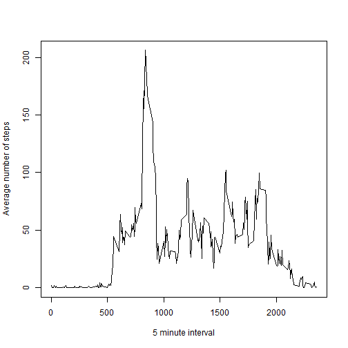
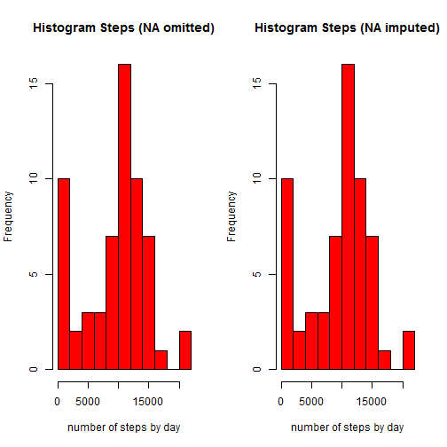

## Peer Assessment 1: activity monitoring data

### For this assessment the dplyr and lattice package will be used. 


```r
library(dplyr)
library(lattice)
```

### Loading and preprocessing data.


```r
df <- read.csv(unz("activity.zip", "activity.csv"))
df$date <- as.Date(df$date, format = "%Y-%m-%d")
```

### What is the mean and median of total number of steps taken per day?


```r
df_by_day <- group_by(df, date)
df_by_day <- summarise(df_by_day, sum=sum(steps, na.rm = TRUE))
mean_by_day <- round(mean(df_by_day$sum, na.rm = TRUE), digits =0)
median_by_day <- median(df_by_day$sum, na.rm = TRUE)
hist(df_by_day$sum, col = "red", main = "Histogram Steps", xlab = "number of steps by day", breaks = 10)
```

 

The mean of the total number of steps by day is 9354.

The median of the total number of steps by day is 10395.

### What is the average daily activity pattern?


```r
df_by_interval <- group_by(df, interval)
df_by_interval <- summarise (df_by_interval, mean = mean(steps, na.rm = TRUE))
max <- df_by_interval[which.max( df_by_interval$mean),1]
with(df_by_interval, {plot(interval, mean,  xlab= "5 minute interval", ylab = "Average number of steps", type = "l")})
```

 

Interval 835 contains the maximum number of steps.

### Imputing missing values


```r
na_rows <- nrow(df)-sum(complete.cases(df))
na_steps <- sum(is.na(df$steps))
na_date <- sum(is.na(df$date))
na_interval <- sum(is.na(df$interval))

df_ex_na <- group_by(df, interval)
df_ex_na <- mutate(df_ex_na, steps=ifelse(is.na(steps), median(steps, na.rm=TRUE), steps))

df_ex_na_by_day <- group_by(df_ex_na, date)
df_ex_na_by_day <- summarise(df_ex_na_by_day, sum=sum(steps, na.rm = TRUE))
mean_ex_na_by_day <- round(mean(df_ex_na_by_day$sum, na.rm = TRUE), digits = 0)
median_ex_na_by_day <- median(df_ex_na_by_day$sum, na.rm = TRUE)
par(mfrow = c(1,2))
hist(df_by_day$sum, col = "red", main = "Histogram Steps (NA omitted)", xlab = "number of steps by day", breaks = 10)
hist(df_ex_na_by_day$sum, col = "red", main = "Histogram Steps (NA imputed)", xlab = "number of steps by day", breaks = 10)
```

 
  
There are 2304 missing values in the dataset. The variable steps has 2304 missing values. The variable date has 0 missing values. The variable interval has 0 missing values.

The missing values of steps are filled in with the median of the corresponding 5 minute interval.

The mean of the total number of steps by day, with the missing date filled in, is 9504.This mean is higher then the mean calculated in the first part of the assignment.

The median of the total number of steps by day, with the missing date filled in, is 10395. The median is the same as the one previously calculated.   


### Are there differences in activity patterns between weekdays and weekends?


```r
df_ex_na$weekday <- weekdays(df_ex_na$date) %in% c("zaterdag","zondag")
df_ex_na$weekday <- factor(df_ex_na$weekday, labels = c("weekday", "weekend"))

df_avg <- group_by(df_ex_na, interval, weekday)
df_avg <- summarise(df_avg, mean=mean(steps))

with (df_avg, {xyplot(mean ~ interval | weekday, layout = c(1, 2), type = "l", xlab = "interval", 
                    ylab = "number of steps")})
```

 
